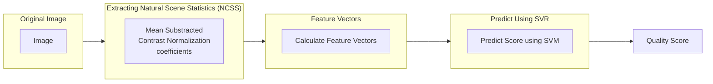

<!--  -->


<!-- PROJECT LOGO -->

<br />
<div align="center">
<h3 align="center">Comparative Study between DSLR and Smartphone Camera</h3>
	<p align="center">
		An objective and subjective comparison between the pictures taken through the two cameras and matching it with the photographer's experience while capturing the pictures.
		<br />
		<a href="https://github.com/vishalgattani/dslr-vs-iphone"><strong>Explore the code »</strong></a>
		<br />
		<br />
		<a href="https://github.com/vishalgattani/dslr-vs-iphone/issues">Report Bug</a>
		·
		<a href="https://github.com/vishalgattani/dslr-vs-iphone/issues">Request Feature</a>
	</p>
</div>

# Table of contents

* TOC
{:toc}


# Objective

This study is aimed at analyzing and comparing the use of Smartphone and DSLR cameras under different lighting conditions and camera settings. We aim to make an objective and subjective comparison between the pictures taken through the two cameras and match it with the photographer's experience while capturing the pictures. Finally, we provide recommendations for conditions under which camera should be preferred over another.

# Methodology

The first step of this analysis is shortlisting the conditions under which the various photographs shall be taken. These conditions are shortlisted to thoroughly explore each functionality and the key features of the smartphone camera and the DSLR. The shortlisted conditions include the following settings:

1. Photos of objects under indoor lighting conditions
2. Landscape Photos under outdoor lighting conditions
3. Photos of a subject in outdoor lighting conditions
4. Photos of a subject in outdoor lighting conditions in portrait mode
5. Photos of a fast-moving object
6. Photos in the long exposure mode of a smartphone camera
7. Nighttime photography of a subject

A set of pictures are taken by a group of five photographers who take pictures under the given conditions using a DSLR as well as a smartphone camera. The photographer is asked to maintain a similar exposure value for the pictures taken by the DSLR and the iPhone to maintain a fair comparison. The photographer is required to fill out a survey that contains questions about their experience clicking the pictures each time the photographer finishes clicking a set of the photos. These sets of pictures are shown to multiple viewers who provide a subjective analysis of the photos through another survey. A screenshot of both these surveys can be found in Appendix A. The photographs are also analyzed objectively using a custom program built using the `OpenCV` image library. The data obtained through analyzing these photos objectively and subjectively are combined to form the final recommendations that suggest the optimal camera to use based on the conditions.

# Metrics

The metrics defined for the analysis of each image are as follows:

## Objective Metrics

1. Exposure: Exposure is commonly defined as the amount of light that reaches the image sensor. For this study, the photographers are asked to maintain the same exposure value. The exposure value is calculated using the following formula:


$$ EV = log_2(100 * aperture^2 / (ISO * shutter speed))$$

From [Exposure](https://www.omnicalculator.com/other/exposure) and [Shutter Speed](https://www.omnicalculator.com/other/shutter-speed):

| EV | Type of lighting situation |
| --- | --- |
|-7|Deep star field or the Milky Way.|
|-6|Night under starlight only or the Aurora Borealis.|
|-5|Night under crescent moon or the Aurora Borealis.|
|-4|Night under half moon, or a meteor shower (with long exposure duration).|
|-3|Night under full moon and away from city lights.|
|-2|Night snowscape under full moon and away from city lights.|
|-1|Start (sunrise) or end (sunset) of the "blue hour" (outdoors) or dim ambient lighting (indoors).|
|0|Dim ambient artificial lighting.|
|1|Distant view of a lit skyline.|
|2|Under lightning (with time exposure) or a total lunar eclipse.|
|3|Fireworks (with time exposure).|
|4|Candle-lit close-ups, Christmas lights, floodlight buildings, fountains, or bright street lamps.|
|5|Home interiors at night, fairs and amusement parks.|
|6|Brightly lit home interiors at night, fairs and amusement parks.|
|7|Bottom of a rainforest canopy, or along brightly-lit night-time streets. Floodlit indoor sports areas or stadiums, and stage shows, including circuses.|
|8|Store windows, campfires, bonfires, ice shows,Floodlit indoor sports areas or stadiums, and interiors with bright fluorescent.|
|9|Landscapes, city skylines 10 minutes after sunset, neon lights.|
|10|Landscapes and skylines immediately after sunset, capturing a crescent moon using a long lens.|
|11|Sunsets. Subject to deep shade.|
|12|Open shade or heavy overcast, capturing half moon using long lens.|
|13|Cloudy-bright light (no shadows), capturing gibbous moon using long lens.|
|14|Weak hazy sun, rainbows (soft shadows), capturing the full moon using long lens.|
|15|Bright or hazy sun, clear sky (distinct shadows).|
|16|Bright daylight on sand or snow (distinct shadows).|
|17-19|Very bright artificial lighting.|
|20+|Extremely bright artificial lighting, telescopic view of the sun.|


1. Tonal Range: To calculate the tonal range of an image, we use an HSV map. The colors from the map that are not present in the image are blackened out. Alternatively, the color range is also calculated in the form of a percentage.
2. Contrast: An intensity histogram is used to calculate the contrast in the images. Images with higher contrast are expected to show two peaks that are separated by low intensities. Pictures with lower contrast have an equal spread of intensities on the histogram.
3. Camera settings:
The camera settings used for this analysis are as follows:
- Aperture: The aperture opening is the place where the light gets into the camera. Aperture settings come in values called the f-stop, or f-number, that range from values as low as f/1.0 (for large aperture opening) to as high as f/64 (for really small pinhole size aperture openings). The larger the aperture opening is, the more light is allowed to enter. The smaller the aperture opening is, the lesser light is allowed to enter. The aperture opening also affects the depth of field of the photo.
- Shutter speed: The duration that the shutter is left open depends on the shutter speed of our camera. The faster the shutter speed is, the lesser the amount of light that the sensor is exposed to. Shutter speed can be set from fractions of a second (for sports or action photography) to a couple of minutes (for long exposure shots).
- ISO: As the light enters the camera, it goes straight to the sensor. The sensor has a property called the ISO sensitivity, or ISO speed, which describes how much light it processes at a given amount of time. The ISO sensitivity can have a value of as low as 100 up to as high as 102400 (for some high-end cameras).
- [Blur value](https://pyimagesearch.com/2015/09/07/blur-detection-with-opencv/): The blur value of the image is defined using the variance of the laplacian kernel when convolved with the image. The Laplacian highlights regions of an image containing rapid intensity changes. Since a blurred image would not have rapid intensity changes, the score of the image would be lower.
- [BRISQUE quality score](https://learnopencv.com/image-quality-assessment-brisque/): The method to calculate the **BRISQUE** score of the image is taken from the paper referenced at the end of the report.


## Subjective Metrics

Subjective metrics are calculated for the photographer as well as the viewer. The photographer’s opinion is important to map the objective metrics to their experience while taking the images. The viewer's opinion on the images is equally important since the viewer offers an unbiased opinion of the photograph. Furthermore, the viewer's opinions may differ from the objective values of the image since photography is a form of art and is open to interpretation.

### Photographer Subjective Metrics:
1. Image Satisfaction
	- Framing
	- Camera-angle: This factor is used to analyze the different camera angles and thus the maneuverability of each camera.
	- Blur/steadiness
	- Color reproduction: Different places and different lighting conditions can affect the colors captured by the camera. The automatic settings on the camera can struggle to produce the correct colors and tones and may require manual adjustment.
2. Fatigue: This metric is used to evaluate the photographer’s comfort levels with each camera and provides insights into the suitability of each camera for long photography sessions.
3. Set-up time: This includes the time required to set up camera accessories like the tripod. It also includes the time involved in changing lenses for the DSLR.
4. Camera focus
	- Speed: This metric defines the time it took for the photographer to successfully focus on the subject.
	- Accuracy: This metric determines how confident the photographer feels they have been able to focus on the subject.
	- Overall image satisfaction

### Viewer Subjective Metrics (through visual inspection of the image):

1. Natural/Realistic: This metric is used to define how natural the image looks. It focuses on color reproduction and how well each camera can adjust its settings to make the image appear natural.
2. Tonal Range
3. Blur
4. Distortion: This metric refers to lens distortion.
5. Texture: This metric defines how well the image has captured details such as the texture of the objects and the surfaces.

# [Image Quality Assessment (IQA)](https://learnopencv.com/image-quality-assessment-brisque/)

Image Quality Assessment (IQA) algorithms take an arbitrary image as input and output a quality score as output. There are three types of IQAs:

1. Full-Reference IQA: Here you have a ‘clean’ reference (non-distorted) image to measure the quality of your distorted image. This measure may be used in assessing the quality of an image compression algorithm where we have access to both the original image and its compressed version.
2. Reduced-Reference IQA: Here you don’t have a reference image, but an image having some selective information about it (e.g. watermarked image) to compare and measure the quality of distorted image.
3. Objective Blind or No-Reference IQA: The only input the algorithm gets is the image whose quality you want to measure. This is thus called, No-Reference or Objective-Blind.

## Image Quality Assessment (IQA) Dataset


<p align="center">


<br>

<a href="https://pdfs.semanticscholar.org/6dd3/7b57f3391b438fa588f98a1c2067365ae5ca.pdf">TID2008 Image Quality Score Scaling (0 to 100) : lesser the score, better the subjective quality.</a>

</p>


## Blind/Referenceless Image Spatial Quality Evaluator (BRISQUE)

The steps needed for BRISQUE algorithm used for No-Reference IQA are as follows:


### Extract Natural Scene Statistics (NSS)

The distribution of pixel intensities of natural images differs from that of distorted images. This difference in distributions is much more pronounced when we normalize pixel intensities and calculate the distribution over these normalized intensities. In particular, after normalization pixel intensities of natural images follow a Gaussian Distribution (Bell Curve) while pixel intensities of unnatural or distorted images do not. The deviation of the distribution from an ideal bell curve is therefore a measure of the amount of distortion in the image.

#### Mean Subtracted Contrast Normalization (MSCN)

There are a few different ways to normalize an image. One such normalization is called **Mean Subtracted Contrast Normalization (MSCN)**.

<p align="center">

</p>

<p align="center">

</p>

#### Pairwise products for neighborhood relationships

MSCN provides a good normalization for pixel intensities. However, the difference in natural vs. distorted images is not limited to pixel intensity distributions, but also the relationship between a pixel and its neighbors.

To capture neighborhood relationships the authors used **pair-wise products** of MSCN image with a shifted version of the MSCN image. Four orientations are used to find the pairwise product for the MSCN coefficients, namely: Horizontal (H), Vertical (V), Left-Diagonal (D1), Right-Diagonal (D2).

### Calculate Feature Vectors

Until now, we have derived 5 images from the original image — 1 MSCN image and 4 pairwise product images to capture neighbor relationships (Horizontal, Vertical, Left Diagonal, Right Diagonal).

Next, we will use these 5 images to calculate a feature vector of size 36×1 ( i.e. an array of 18 numbers). Note the original input image could be of any dimension (width/height), but the feature vector is always of size 36×1.

|Feature Range|Feature Description|Procedure|
|---|---|---|
|1 - 2|Shape and Variance.|GGD fit to MSCN coefficients.|
|3 - 6|Shape, Mean, Left Variance, Right Variance|AGGD fit to Horizontal Pairwise Products|
|7 - 10|Shape, Mean, Left Variance, Right Variance|AGGD fit to Vertical Pairwise Products|
|11 - 14|Shape, Mean, Left Variance, Right Variance|AGGD fit to Diagonal (left) Pairwise Products|
|15 - 18|Shape, Mean, Left Variance, Right Variance|AGGD fit to Diagonal (Right) Pairwise Products|

### Prediction of Image Quality Score

In a typical Machine Learning application, an image is first converted to a feature vector. Then the feature vectors and outputs ( in this case the quality score ) of all images in the training dataset are fed to a learning algorithm like Support Vector Machine (SVM).

For the purposes of this project, the trained model provided by the authors is used. The code to predict the quality score using the feature vector computed is shown below.

```python
# load the model from allmodel file
model = svmutil.svm_load_model("./bin/allmodel")
# create svm node array from features list
x, idx = gen_svm_nodearray(x[1:], isKernel=(model.param.kernel_type == PRECOMPUTED))
nr_classifier = 1 # fixed for svm type as EPSILON_SVR (regression)
prob_estimates = (c_double * nr_classifier)()
# predict quality score of an image using libsvm module
qualityscore = svmutil.libsvm.svm_predict_probability(model, x, dec_values)
```

